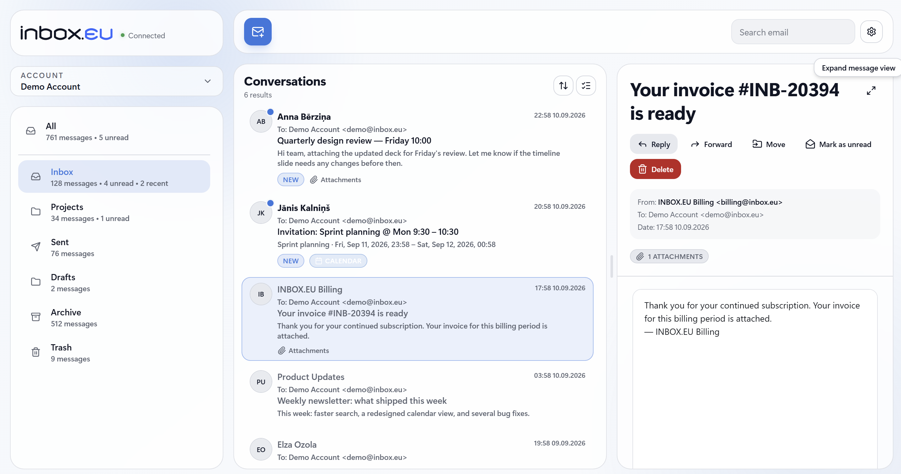
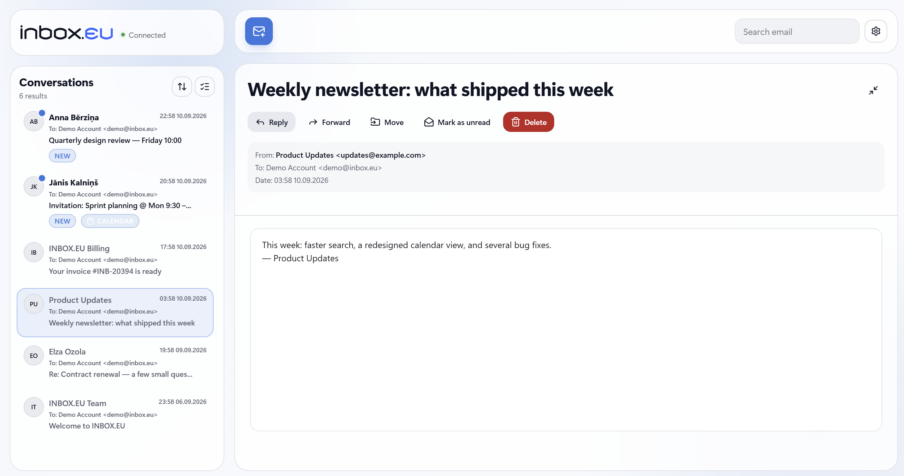
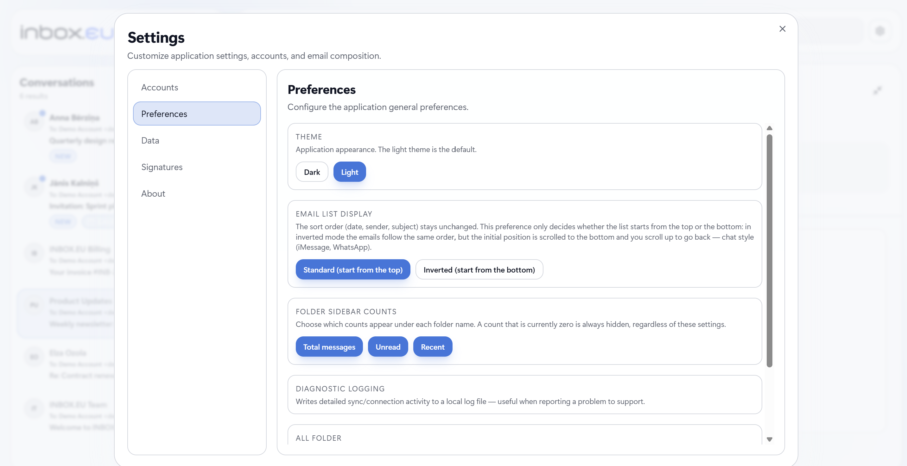
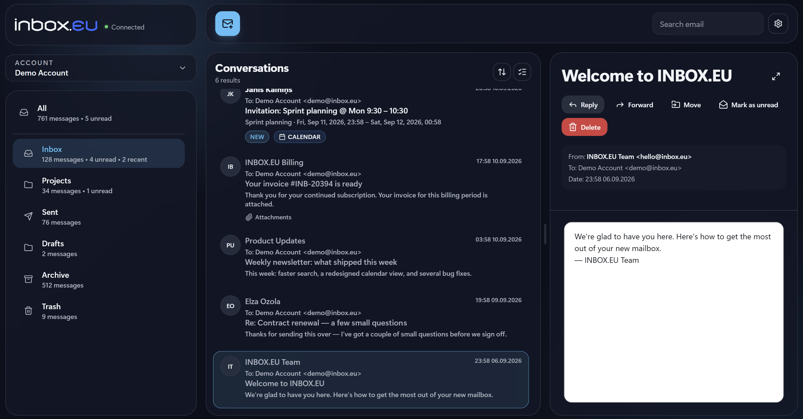

  
  <h1>INBOX.EU Mail</h1>
  
<strong>A fast, modern, lightweight desktop email client made by inbox.eu</strong>

  
desktop email client · any IMAP/SMTP · gmail · cross-platform · open source

---

## INBOX.EU Mail app

Created by INBOX.EU, INBOX.EU Mail brings its email experience to a dedicated
desktop app, with support for Gmail, inbox.eu and other IMAP/SMTP accounts. 
Available for Windows, macOS, and Linux.

## Download

- **Windows 10/11** — available on the [Microsoft Store](https://apps.microsoft.com/detail/9MXZ1TBVHRK6),
  which also handles updates automatically.
- **macOS 12 or newer, Apple Silicon** — download the signed and Apple-notarized
  **DMG** from [Releases](https://github.com/nimda5/inboxeu-mail-releases/releases).
- **Linux x64** — download **AppImage** or **DEB** from
  [Releases](https://github.com/nimda5/inboxeu-mail-releases/releases). AppImage
  requires FUSE 2. DEB is for compatible Debian/Ubuntu systems.

The published Mac and Linux packages offer INBOX.EU (selected by default) and
Other IMAP/SMTP accounts. Gmail sign-in is hidden while Google verification is
ongoing. These packages check for updates and offer the matching download;
installation is manual.

## What is inbox.eu

[inbox.eu](https://www.inbox.eu) is a European email and file-storage service
that has been running since 1998, used by individuals and businesses across
many countries. It's built around a simple pitch: private, ad-free email that
stays yours — no tracking, no data mining, no sharing your mail with third
parties — bundled with generous file storage instead of the cramped quotas
most providers ship by default.

On top of the mailbox itself, inbox.eu adds advanced spam/phishing/malware
filtering, custom-domain business email with premium mailboxes included,
painless migration from other providers, and multi-device access — desktop,
mobile apps, and standard IMAP/SMTP so it plugs into any mail client.

## Screenshots

Received attachments use responsive cards with image thumbnails, separate preview
and download actions, and Download all for multiple files. The full-window image viewer supports
Left/Right navigation and Escape; supported raster images up to 8 MiB can be
previewed, while other files remain downloadable. Small thumbnails and bounded
gallery images keep large originals out of the interface's image cache; downloads
preserve the originals.

  
  
  
  

## Highlights

- **Gmail / INBOX.EU / other IMAP** behaviour is managed through the mail-provider architecture.

- **Message identity in lists** — Inbox and received mail show sender addresses;
  Sent and Drafts show recipient names and email addresses, with Cc identified
  correctly when no To recipients exist. Empty drafts say No recipients.
  All folders adds the receiving account's provider icon first in each row's badges.

- **Message context menu** — right-click text to copy or search, links to open
  or copy their address, and body images to download or forward as a regular
  attachment. Reply, Forward, Print, Download message and View source are also available.

- **Prompt send confirmation** — Send now skips the Undo delay; success appears
  when SMTP accepts the message, while Sent-folder synchronization finishes in the background.
  The same notification changes from Waiting to send to Sending to Message sent.

- **Consistent compose actions** — equally sized Cancel and Send stay visible in a fixed bottom bar, including expanded editing and short windows.
- **Independent signature formatting** — new writing uses the preferred font size on a separate line before the saved signature.
- **Clear account cache safely** — Settings > Data shows estimated storage per account. Clear cache downloads mail again while preserving your signature, login and settings.
- **Quiet empty compose** — a new message containing only its automatic signature
  closes immediately; written content and saved drafts retain the save/discard prompt.

- **Spelling in the composer** — native suggestions and corrections in the subject
  and body. Windows follows typed input languages; Linux supports manually selected
  languages; macOS uses its system spelling service. Settings > Spelling and the
  editor's right-click menu control checking and languages. Missing dictionaries
  download on request, or after 100 typed letters in a new Windows input language.
  Downloaded dictionaries work offline; unavailable platform languages stay listed.
- **Multi-account by design** — several IMAP/SMTP accounts side by side, with
  a unified inbox and per-account folder hierarchies. Local provider badges
  beside account avatars in the title strip, account menu and Settings identify
  Gmail, INBOX.EU and other IMAP mailboxes without loading logos from the network.
  The INBOX.EU badge uses the bundled app mark at the same size as Gmail.
- **Clear sign-in validation** — both first-run setup and Add Account check the
  email address before connecting. Invalid input gets a hint beside the field;
  surrounding spaces are removed, and custom domains and plus tags are supported.
- **Privacy policy** — adding an account requires an explicit agreement to the
  [Privacy Policy](https://help.inbox.eu/privacy-policy) for every provider.
  The policy also remains accessible in Settings > About.
  About describes the app's INBOX.EU roots and support for Gmail and other
  IMAP/SMTP accounts.
- **Refused sign-in** — requests waiting on an account that needs a new sign-in
  fail promptly, allowing message viewing to continue in another account.
  Interrupted mail actions remain queued for replay after credentials change.
  Message viewing also uses independent queues per account, so a slow or offline
  mailbox cannot delay opening a message from another account.
- **Gmail development path** — the separate dev profile can connect a Gmail
  account using system-browser OAuth with PKCE and IMAP XOAUTH2. Set the Desktop OAuth client
  credentials in `.env` and `SIEVER_DEV_PROFILE=1`; Gmail remains hidden
  in release builds while integration testing is in progress. Release packages
  include only the allow-listed runtime values from `.env`; Store submission
  credentials and other build-machine secrets are excluded.
  Outlook.com and Microsoft 365 support is in the
  research and registration planning stage,
  including personal/corporate onboarding and the Graph-versus-IMAP decision;
  Microsoft account sign-in is not available yet.
  Gmail's system mailboxes are shown alongside Inbox, while user-created Gmail
  labels appear in Labels and stay synchronized with Gmail. The app's Important
  mark toggles Gmail Starred; Gmail's separate importance classification appears
  only as an outline hint. Signing in again
  with the same Google account renews access without replacing local account data.
  When Google access is revoked or expires, the account says so in a banner with
  a Sign in to Google button, and a refused send offers the same instead of Retry.
  Google sign-in finishes without closing the browser.
  The unified All view uses Gmail's X-GM-MSGID to show messages with multiple
  Gmail labels once. In All's folder choices, Gmail All Mail contributes only
  archived mail; Inbox and Sent remain independent choices. The first run after
  this change rebuilds the Gmail mail cache.
  Gmail INBOX shows the Primary view, while Promotions, Social and Updates
  appear as separate virtual folders backed by Gmail's own category search.
  These views do not create extra message copies; All still includes every category.
  A background IMAP LIST discovers labels created in Gmail web; MODSEQ and
  X-GM-LABELS refresh existing cached messages, including the open Inbox.
  Removing an account deletes its local mail cache and account preferences.
- **Snappy native feel** — the mail list, viewer and tree pickers are tuned
  to behave like a native client (precise truncation, keyboard navigation,
  real focus rings). An open message's subject and addresses scroll away
  with it while the action toolbar stays pinned; in the three-pane layout
  the header folds to a compact sender line, leaving the message most of
  the column. Both column dividers track dragging without re-rendering
  the mail list on every pointer movement; widths save when released. The
  Windows tray uses a multi-size ICO
  with native DPI frames, packaged as a physical resource for both installer
  and Microsoft Store builds so the notification area can select the right image.
  Windows tray, taskbar and app-list icons, Linux launcher icons, desktop
  notifications and in-app provider marks use full-width artwork without
  extra transparent padding. macOS Dock assets retain their optical margins.
- **Real rich-text composer** — Squire-based editor with proper line-height,
  paste sanitisation and signature handling. New text defaults to 16 px, with
  an adjustable size in Settings → Preferences that saves immediately and shows
  a confirmation there; attach files with the picker or
  by dragging them in from the file manager. Replies open with the caret in
  the message body; Tab from Subject also goes straight to the body. Closing
  a message offers Save to Drafts, including its attachments. Messages in
  Drafts open directly in the composer; saving changes replaces the server
  copy, and sending removes it after successful delivery. Forward includes
  the original attachments, keeping their full quality and filenames through
  Undo/Retry; Reply continues to omit them.
- **Automatic preference saving** — Preferences controls save when changed.
  A confirmation appears over the Preferences heading for three seconds after
  each successful change, without moving the settings below it.
- **Labels** — Important plus named, colored labels per account, usable as
  one-click filters in any folder or across all folders. INBOX.EU uses its
  ten `$LabelN` IMAP keyword slots; Gmail uses server labels. Other IMAP
  accounts still support Important, without INBOX.EU-specific custom labels.
- **Undo** — every message waits 7 seconds behind a "Waiting to send…" toast with Undo;
  Undo brings it back into the composer, Send now sends at once. Emptying a
  folder waits the same way, so a mis-click never loses mail.
- **Print, save and inspect** — a print preview of any message, ready to
  print or save as PDF (subject, From, To, Cc, Bcc, date, the attachment
  list and calendar invite details above the body); download it as a `.eml`
  file any mail client opens; or view its raw source with every header.
- **External email images** — images in received mail load through a guarded
  local loader, including hosts that refuse direct cross-origin embedding.
  The loader sends no mailbox credentials or cookies. Image hosts can still
  see the request and public IP; default image blocking remains planned.
- **Attachment size warning** — choosing or dropping files updates an
  estimated full message size and shows a clear red warning when it exceeds
  the account provider's published sending limit.
- **Your default mail app** — one click in Settings → Preferences (on
  Windows, confirmed in Windows Settings) and email links in your browser
  and other apps open a new message here, recipients and subject filled in.
  Email links inside messages also open this app's composer directly.
- **Folder management** — create, rename, empty and delete your own
  folders (up to three levels inside Inbox) from Settings → Folders or a
  right-click on a folder; system folders stay protected, and deleted mail
  goes to Trash first. For an account on another mail server, Settings →
  Folders sets the order its folders appear in.
- **Live background sync** — IMAP IDLE pushes changes for the open folder,
  while a light periodic status check picks up the rest, one folder at a time.
  MODSEQ polling also catches external flag and keyword changes missed by
  IDLE; newly observed IMAP labels appear in the open UI without reconnecting.
- **Encrypted credentials at rest** — passwords and tokens pass through the
  OS keychain via Electron's `safeStorage`.
- **A changed password is not hammered** — when the server stops accepting
  the saved password, the account stops logging in (so the server has no
  reason to lock it) and shows a banner with Update password and Try again;
  a send it refused offers the same update, then reopens the message.
- **Local-only data** — everything lives in a SQLite database on the user's
  machine. No remote analytics, no third-party tracking.
- **Calendar invitations** — event details are available for every account;
  response buttons and the calendar link are available only for INBOX.EU accounts.
- **Private mail stays local** — mailbox exports and the optional local mock
  preview are excluded from Git and from desktop packages.
- **Broken-image layout stays intact** — failed mail images become transparent
  spacers, while Reply and Forward send their original remote URLs.
- **Upgrade-safe migrations** — the local database is migrated forward in
  place on every update, keeping accounts, settings and the mail cache.
- **Branded startup** — the welcome screen shows the logo and a loading state
  until accounts are ready; the Microsoft Store package includes a native
  splash image for the time before Electron draws its window.
- **Space for mail** — search and Settings sit in the window's title bar,
  as in Outlook, so the message list and the viewer start right under it.
- **Stable title-bar controls** — outlined Settings and the account avatar
  stay at the right edge, independently of search and the reading-pane layout;
  a divider separates them from native Windows window controls.
  Extra vertical spacing keeps search and the avatar clear of the mail panes.
- **Remembers your layout per screen setup** — window size, position and
  maximized state, plus the pane widths of each view (folders shown, folders
  collapsed, message expanded), are kept separately for the laptop screen on
  its own and for each docked monitor setup, and switch over by themselves
  when you dock or undock.
- **Light and dark themes** — follows the system light/dark mode by default,
  or stays on the one you pick.

## Privacy and support

- [Privacy Policy](https://help.inbox.eu/privacy-policy)
- [INBOX.EU Help](https://help.inbox.eu)
- [INBOX.EU](https://inbox.eu)

## Updates

`updates.json` lists verified published versions separately for each supported platform and package format. An empty list means no versions are advertised yet. Windows updates are delivered through Microsoft Store.
